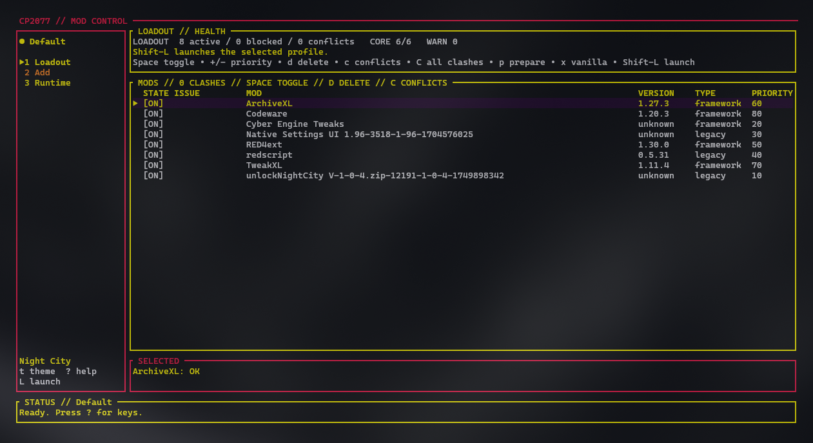
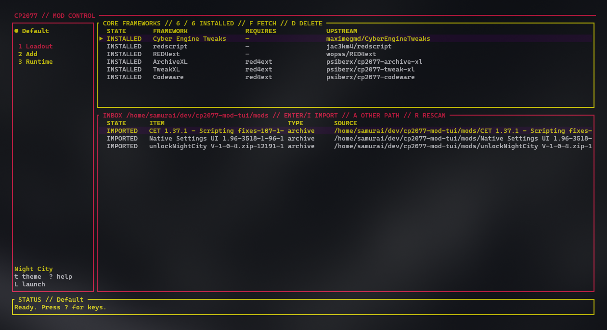
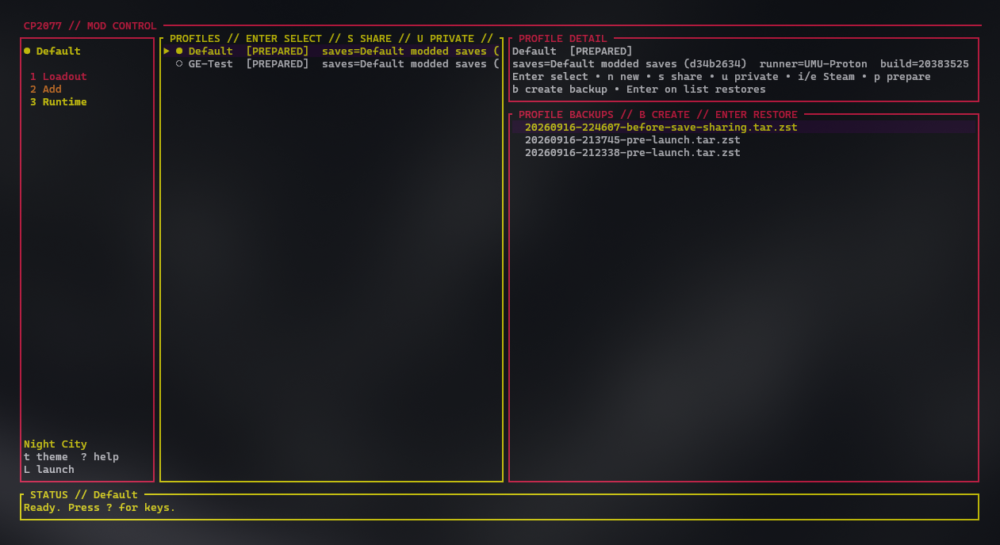

# cp2077-mod-tui

`cp2077-mod-tui` is a profile-based Cyberpunk 2077 mod manager and launcher for
Linux. It is designed for native Steam installations on Arch Linux, CachyOS,
and other Arch-derived systems, including Hyprland sessions.

The central safety rule is simple: the Steam installation remains vanilla.
Modded sessions are assembled in an immutable loadout layer and mounted over
the game with `fuse-overlayfs`. The game then runs through `umu-launcher` with
a profile-specific Proton prefix, saves, generated files, and DLL overrides.
Normal Steam launch options, compatdata, and game files are not changed.

## Status

This is an initial working release. It includes:

- Native and Flatpak-Steam-path discovery for app 1091500 and external Steam libraries.
- Named, isolated profiles and reversible loadout revisions.
- Safe local ZIP/7z/RAR/tar/directory import from the TUI or CLI through libarchive.
- Content-addressed source archives and immutable extracted layers.
- Dependency inference and reversible cascade-disable behavior.
- Curated upstream fetching for CET, redscript, RED4ext, ArchiveXL, TweakXL, and Codeware.
- Per-file conflict detection and deterministic priority-based loadout construction.
- Legacy and official REDmod layout detection, REDmod deployment, and `-modded` launching.
- UMU prefix setup with `vcrun2022`, `d3dcompiler_47`, and optional `.NET 6`.
- Four-color Night City, Arasaka, Mox, and Samurai TUI themes.
- Shared modded save sets, explicit local Steam save import/export, backups,
  and stale mount/profile lock recovery.

Nexus OAuth, `nxm://`, FOMOD installers, Steam Cloud synchronization, and
non-Steam game stores are intentionally outside the first release.

## Screenshots

### Loadout



### Add



### Runtime



## Arch installation

Enable the `multilib` repository for Steam and UMU, then install runtime tools:

```bash
sudo pacman -S --needed steam umu-launcher fuse-overlayfs winetricks libarchive
```

Build and run:

```bash
cargo build --release
./target/release/cp2077-mod-tui doctor
./target/release/cp2077-mod-tui
```

The application never runs `sudo`. The included `packaging/PKGBUILD` is a
release template for an AUR package once the project is published.

## First run

1. Run `cp2077-mod-tui doctor`. Resolve missing system dependencies.
2. If using official REDmods, install the free Steam DLC 2060310. Steam needs
   the game library mounted read-write for DLC installation and game updates.
3. Put manually downloaded archives or extracted mod directories in `./mods/`,
   open Add (`2`) and press `Tab` to reach Inbox, then `Enter` to import.
   Press `a` to import a directory or archive from anywhere else. Core
   frameworks sit in the same mode; press `f` on a Core row to fetch one.
   CLI equivalents:

   ```bash
   cp2077-mod-tui framework fetch red4ext --profile Default
   cp2077-mod-tui framework fetch archivexl --profile Default
   cp2077-mod-tui import ~/Downloads/my-mod.7z --version 1.0 --profile Default
   ```

4. Review the loadout on `1` (mods on the left, file conflicts on the right). The CLI
   equivalents remain available for scripting:

   ```bash
   cp2077-mod-tui profile show Default
   cp2077-mod-tui conflicts Default
   cp2077-mod-tui launch Default --dry-run
   ```

5. Press `p` on Loadout or Runtime to prepare the isolated runtime. Prepare
   it again when its Windows prerequisites change. The CLI equivalent is:

   ```bash
   cp2077-mod-tui prepare Default
   ```

6. Launch from the TUI with `Shift-L`, or use:

   ```bash
   cp2077-mod-tui launch Default
   ```

Steam should be running for best-effort Steamworks integration. Direct UMU
launches do not guarantee Steam Overlay, achievements, playtime, or Steam Cloud.

## TUI mod inbox

The Add mode's Inbox pane scans `./mods/`, relative to the directory from which the
application was started. When launched from a source checkout, that is the
repository's `mods/` directory. Each immediate child directory or supported
archive (`.zip`, `.7z`, `.rar`, tar and compressed tar formats) is an import
candidate. The inbox contents are ignored by Git.

Importing snapshots the source into managed immutable storage and enables it
in the selected profile. An item marked `IMPORTED` can safely remain in the
inbox; importing it again simply re-enables the existing managed release.
Editing an already imported source does not update its managed snapshot yet.

## TUI keys

- `1` Loadout, `2` Add, `3` Runtime
- `h`/`l` or Left/Right/Tab: move along sidebar ↔ primary list ↔ extra pane
- `j`/`k` or Up/Down: move in the focused pane; on the sidebar, switch modes
- `Enter` from the sidebar: focus the mode's primary list
- `Enter` on Runtime profiles: select a profile
- `n` on Runtime: create and select a new isolated profile
- `s` on Runtime: share the active profile's modded saves with the highlighted profile
- `u` on Runtime: detach the highlighted profile to a private copy of the shared saves
- `i` on Runtime: import local vanilla Steam saves into the highlighted profile
- `e` on Runtime: export the highlighted profile's saves to the local Steam prefix
- `p` on Loadout or Runtime: prepare the selected profile
- `Space` on Loadout: toggle a mod in the selected profile. Enabling a mod with disabled dependencies or an already-on duplicate asks first (`y` fix, `n` enable only, Esc cancel)
- `+`/`-` on Loadout: raise or lower the selected mod's conflict priority
- `c` on Loadout: open or close the full-width file conflicts view
- `C` on Loadout: show all collisions vs the highlighted mod
- `x` or `v` on Loadout: disable all profile mods after confirmation
- `Enter`/`i` on Add Inbox: import the selected inbox item and enable it
- `a` on Add: enter a mod directory or archive path from anywhere
- `r` on Add Inbox: rescan `./mods/`
- `f` on Add Core: fetch and enable the selected curated core framework; if it is already installed, `y` enables the existing copy and `r` replaces it
- `d` on Loadout or Add Core: delete the selected release from the library after confirmation
- `b` on Runtime: back up isolated saves and runtime state
- `Enter` on Runtime backups: restore the selected backup after confirmation
- `t`: cycle the four-color theme presets
- `Shift-L`: launch
- `?`: key help overlay
- `q` or `Esc`: quit

## State and recovery

State follows the XDG base directory specification:

- Configuration/theme: `$XDG_CONFIG_HOME/cp2077-mod-tui`
- Database, archives, profiles and backups: `$XDG_DATA_HOME/cp2077-mod-tui`
- Downloads/extraction: `$XDG_CACHE_HOME/cp2077-mod-tui`
- Live mounts: `$XDG_RUNTIME_DIR/cp2077-mod-tui`

Every imported archive is retained by SHA-256. Every loadout change creates a
database revision. Automatic pre-launch backups contain profile runtime state
and isolated saves, not the game or immutable loadout files. Profiles may opt
into a named save set under `$XDG_DATA_HOME/cp2077-mod-tui/save-sets`; these
sets are shared only by explicitly attached modded profiles and are snapshotted
under `backups/save-sets` before launch. Steam's `compatdata/1091500` saves are
never linked, imported, exported, or modified by save sharing.

On Profiles, the `●` row is the active source profile and `▶` is the movable
cursor. To share saves, leave the source active, move `▶` to another profile
without pressing Enter, press `s`, and confirm. Both private profile states are
backed up first. The source saves become authoritative; the target's previous
save directory is retained under its `detached-saves` directory. The CLI
fallbacks are:

```bash
cp2077-mod-tui profile share-saves SOURCE TARGET
cp2077-mod-tui profile private-saves PROFILE
cp2077-mod-tui profile import-steam-saves PROFILE
cp2077-mod-tui profile export-steam-saves PROFILE
```

Steam save import/export is an explicit, confirmed replacement rather than a
background sync. Cyberpunk and Steam must both be fully closed. Import backs up
the modded destination and only reads Steam's local save directory. Export
backs up Steam's local saves under `backups/steam-saves` before replacement.
Transfers use a staging directory on the destination filesystem, require at
least one `sav.dat` slot, and preserve Steam's own `steam_autocloud.vdf` file.
Steam Cloud can still report a local/cloud conflict after an export; review its
timestamps carefully and choose the newly exported local files only when that
is what you intend.

Selecting the vanilla loadout with `x` or `v` disables every requested mod in
the selected profile and records a revision. It does not need to repair or
rewrite the Steam installation: normal Steam launches are always vanilla, and
the mod overlay exists only during a TUI-managed launch. The CLI fallback is:

```bash
cp2077-mod-tui mod disable-all Default
```

If a launch is interrupted, rerun `doctor`. A stale profile lock is discarded
when its recorded PID no longer exists, and a stale FUSE mount can be detached
with:

```bash
fusermount3 -uz "$XDG_RUNTIME_DIR/cp2077-mod-tui/PROFILE_ID/game"
```

The application refuses to launch after the Steam build ID changes until the
profile is reviewed. `--force` records the operator's explicit decision at the
command line; use it only after confirming framework compatibility.

## Archive rules

An archive should contain a Cyberpunk game-root layout such as `archive/`,
`bin/`, `r6/`, `red4ext/`, or `mods/`. A single wrapper directory is removed
automatically. REDmods containing `info.json` are placed under `mods/<name>`.
Ambiguous multi-variant archives are rejected rather than guessed; extract the
desired variant to a directory and import that directory.

Files from higher-priority mods win exact path conflicts. The manager does not
attempt semantic merging of DLLs, scripts, XML, YAML, or INI files.

Priorities can also be set precisely from the command line:

```bash
cp2077-mod-tui mod priority Default MOD_ID 100
```

## Themes

The theme file exposes exactly four RGB roles:

```toml
name = "Custom"
background = [10, 7, 18]
surface = [35, 14, 48]
primary = [238, 28, 76]
accent = [247, 239, 0]
```

Edit the file while the TUI is closed, or press `t` in the TUI to cycle the
four presets. The active theme is shown in the sidebar footer.

## Development

```bash
cargo fmt --check
cargo clippy --all-targets --all-features -- -D warnings
cargo test --all-targets
```

The test suite uses synthetic game and mod trees. It must never point tests at
the real Steam installation.
